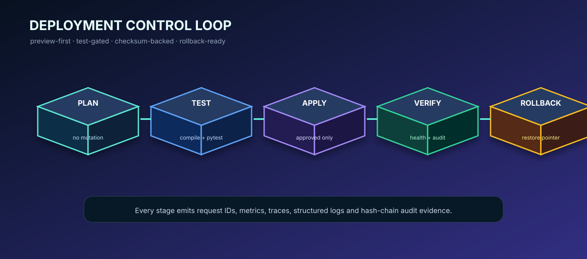

# Kalz OmniSuite


**Kalz OmniSuite** adalah platform operasi Linux native berbasis Python dengan PySide6/QML/QSS, CLI headless, automation engine, distributed processing, OpenAI Agent integration, observability real-time, API gateway, load balancing, dan layered defense.

> **Operational promise:** preview-first, consent-gated, auditable, scope-aware, dan fail-closed untuk operasi yang berisiko.

## Visual System Overview



Diagram di atas menggambarkan alur aktual deployment: `plan` tidak memutasi host, `test` memblokir release yang gagal, `apply` memerlukan approval eksplisit, `verify` memeriksa health dan audit, sedangkan `rollback` mengembalikan release pointer sebelumnya.

Source diagram yang dapat diedit tersedia di [`docs/diagrams/system-architecture.d2`](docs/diagrams/system-architecture.d2). Dokumentasi lengkap tersedia di [`docs/README.md`](docs/README.md).

## Instalasi Langkah demi Langkah

### 1. Persiapkan Linux

Kalz ditujukan untuk Linux modern dengan Python 3.11 atau yang lebih baru. Pastikan `git`, `python3`, dan `python3-venv` tersedia.

```bash
sudo apt update
sudo apt install -y git python3 python3-venv python3-pip
python3 --version
```

Untuk distro berbasis RPM, gunakan paket ekuivalen `python3`, `python3-pip`, dan `python3-virtualenv`.

### 2. Clone repository

```bash
git clone https://github.com/chikalgaming213-eng/kalz-omnisiute.git
cd kalz-omnisiute
git checkout main
```

Untuk deployment reproducible, checkout tag atau commit tertentu, bukan branch bergerak.

## Mode Pengembangan Pilihan 1–4

Repository ini menyediakan empat jalur pengembangan yang saling terhubung. Blueprint inti berada pada workflow, automation, distributed data, ML, security, dan plugin contracts. GUI native memakai `DashboardService` read-only untuk menampilkan status platform, gateway, logs, metrics, dan defense tanpa memberi GUI hak istimewa tambahan. Deployment dan packaging menyediakan manifest Debian, RPM, AppImage, Flatpak, dan Snap. Observability, gateway, load balancing, OpenAI log analysis, dan layered defense bekerja sebagai control planes terpisah yang dapat diverifikasi melalui test suite.

### 3. Buat virtual environment

```bash
python3 -m venv .venv
source .venv/bin/activate
python -m pip install --upgrade pip setuptools wheel
```

### 4. Instal dependency dasar

```bash
pip install -e .
pip install pytest
```

Untuk GUI native:

```bash
pip install -e '.[ui]'
```

Untuk OpenAI Agent:

```bash
pip install openai openai-agents
```

OpenAI bersifat opsional. Core CLI, audit, planner, gateway, defense, dan observability lokal dapat digunakan tanpa API eksternal.

### 5. Konfigurasi secret secara aman

Jangan tulis token di source code, README, commit, issue, atau command history. Gunakan environment atau secret manager.

```bash
export OPENAI_API_KEY="TOKEN_BARU_YANG_SUDAH_DIROTASI"
export OPENAI_MODEL="gpt-4.1-mini"
export OPENAI_TIMEOUT="60"
export OPENAI_MAX_RETRIES="2"
```

Token yang pernah ditempel di chat atau log harus dianggap kompromi dan segera di-rotate.

### 6. Jalankan pemeriksaan dokter sistem

```bash
python -m kalz --doctor
```

Pemeriksaan ini digunakan untuk mendeteksi platform, desktop environment, capability dasar, dan konfigurasi runtime tanpa melakukan perubahan destruktif.

### 7. Jalankan test suite

```bash
python -m compileall -q kalz tests scripts
pytest -q
```

Test harus lulus sebelum menjalankan deployment `apply` atau memasang service systemd.

### 8. Jalankan mode CLI

```bash
python -m kalz --plan curl git
python -m kalz --registry
python -m kalz --doctor
```

Mode plan hanya menghasilkan rencana. Ia tidak memasang paket atau mengubah konfigurasi host.

### 9. Jalankan GUI native

```bash
python -m kalz --gui
```

GUI menggunakan PySide6/QML/QSS dan akan menampilkan ikon aplikasi Kalz pada window, taskbar, dan header dashboard.

## Branding Icon GUI

Semua GUI sekarang menggunakan gambar branding Venom yang Anda berikan pada:

- `QApplication.setWindowIcon()` di `kalz/app.py`;
- `ApplicationWindow.icon` di `kalz/ui/qml/Main.qml`;
- header dashboard QML;
- aset utama `kalz/ui/assets/kalz-venom.png`;
- varian ukuran Linux/Qt `kalz/ui/assets/kalz-venom-16.png` sampai `kalz/ui/assets/kalz-venom-512.png`.

Gambar asli disimpan sebagai aset PNG dan dipakai tanpa menggambar ulang atau mengubah isi visualnya. Varian PNG dibuat hanya melalui downscaling deterministik untuk kebutuhan ukuran window, taskbar, dan header.


## Deployment Otomatis

Selalu mulai dengan plan:

```bash
./scripts/deploy.sh plan
```

Apply membutuhkan approval eksplisit:

```bash
export KALZ_ENV=staging
export KALZ_RELEASE=main
export KALZ_DEPLOY_APPROVED=true
./scripts/deploy.sh apply
```

Verifikasi release aktif:

```bash
./scripts/deploy.sh verify
```

Rollback:

```bash
export KALZ_DEPLOY_APPROVED=true
./scripts/deploy.sh rollback
```

Workflow CI/CD berada di [`.github/workflows/deploy.yml`](.github/workflows/deploy.yml). Pull request menjalankan compile, secret scan, dan test. Tag release dapat masuk ke staging lalu production melalui environment approval GitHub.

Native packaging manifests tersedia di:

| Format | Manifest |
|---|---|
| Debian | `packaging/debian/control` |
| RPM | `packaging/rpm/kalz-omnisiute.spec` |
| AppImage | `packaging/appimage/AppRun` dan desktop entry |
| Flatpak | `packaging/flatpak/org.kalz.OmniSuite.yml` |
| Snap | `packaging/snap/snapcraft.yaml` |

Semua launcher GUI mengarah ke branding icon Kalz yang sama sehingga identitas window, taskbar, desktop entry, dan dashboard konsisten.

## Observability dan Analisis LLM

Subsystem observability menyediakan metrics, structured logs, traces, alerts, export, dan retention. `LogAnalysisService` dapat mengirim konteks log yang sudah dibatasi dan di-redact ke OpenAI Agent. Output LLM bersifat advisory dan tidak dapat melewati policy atau menjalankan remediation privileged secara langsung.

```bash
python -m pytest tests/integration/test_observability.py tests/integration/test_gateway_defense_llm.py -q
```

## Struktur Utama

| Direktori | Fungsi |
|---|---|
| `kalz/core` | runner, workflow, scheduler, orchestration, process lifecycle |
| `kalz/automation` | distro/DE detection, automation engine, backup, reports |
| `kalz/gateway` | API gateway dan distributed load balancing |
| `kalz/defense` | automatic layered defense dan hardening controls |
| `kalz/distributed` | partition, shuffle, workers, checkpoints, pipeline |
| `kalz/ml` | features, models, training, inference, evaluation |
| `kalz/observability` | metrics, logs, traces, alerts, exports, LLM analysis |
| `kalz/securityx` | key management, AEAD, secure channel, access, rotation |
| `kalz/ui` | PySide6/QML/QSS dan application icon |
| `docs` | arsitektur, deployment, diagram, API contract, developer guide |
| `scripts` | generator, repair, deployment, verification helpers |

## Prinsip Operasi

Semua perubahan sistem bersifat **preview-first** dan **consent-gated**. Operasi dijalankan melalui argv terstruktur tanpa shell interpolation, dicatat dalam audit hash-chain, dapat dihentikan melalui panic control, dan ketika gagal hanya melakukan abort, diagnosis, serta recovery plan. Tidak ada perilaku merusak atau penghapusan data otomatis.

## Roadmap

| Versi | Sasaran |
|---|---|
| v0.1 | scaffold, detector, registry, audit, dry-run planner, CLI headless |
| v0.2 | apt/dnf/pacman/zypper/flatpak/snap adapters dengan consent |
| v0.3 | PySide6/QML dashboard, QSS auto-theme, task monitor |
| v0.5 | automation install/config/heal/update/backup/report/scope |
| v0.7 | KDE/XFCE/GNOME adapters, plugin API, scheduler, DB migrations |
| v1.0 | 200+ tool workflows, deb/rpm/AppImage/Flatpak/Snap packaging |
| v1.3 | DE service integrations, accessibility, offline catalogs |
| v1.5 | headless fleet inventory dan encrypted exports |
| v2.0 | plugin marketplace design, reproducible lab profiles |
| v2.5 | digital twin workstation/lab model dan policy simulation |

## Lisensi dan Keamanan

Jangan menjalankan operasi privileged sebelum meninjau plan, scope, consent, dan target. Gunakan backup sebelum perubahan sistem. Laporkan security issue melalui kanal privat repository, bukan issue publik.

## References

[1]: https://docs.python.org/3/library/venv.html "Python virtual environments"
[2]: https://docs.github.com/en/actions "GitHub Actions documentation"
[3]: https://doc.qt.io/qtforpython/ "Qt for Python documentation"
[4]: https://platform.openai.com/docs/ "OpenAI platform documentation"
