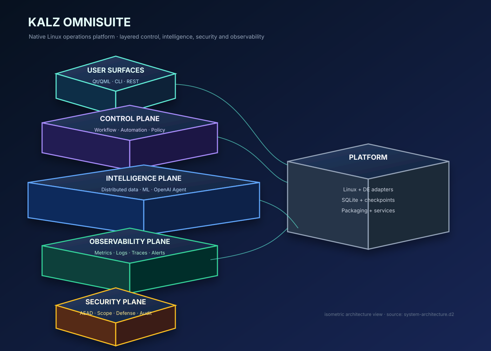

# Kalz OmniSuite



**Kalz OmniSuite** adalah platform operasi Linux native berbasis Python yang menggabungkan desktop GUI PySide6/QML/QSS, CLI headless, automation engine, distributed processing, machine learning, OpenAI Agent integration, real-time observability, API gateway, load balancing, security, OSINT catalog, dan layered defense.

> **Mode aman bawaan:** setiap perubahan host dimulai dari plan, melewati scope dan consent, dicatat ke audit chain, serta tidak dijalankan secara otomatis tanpa approval eksplisit.

Dokumen ini adalah panduan dari **nol sampai runtime**. Ikuti urutannya untuk instalasi lokal, GUI, API, OSINT catalog, testing, deployment, packaging, troubleshooting, dan pengembangan.

---

## Daftar Isi

1. [Status dan ruang lingkup](#status-dan-ruang-lingkup)
2. [Persyaratan sistem](#persyaratan-sistem)
3. [Clone dan verifikasi source](#clone-dan-verifikasi-source)
4. [Bootstrap instalasi](#bootstrap-instalasi)
5. [Instalasi manual](#instalasi-manual)
6. [Dependency GUI](#dependency-gui)
7. [Konfigurasi environment](#konfigurasi-environment)
8. [Verifikasi lengkap](#verifikasi-lengkap)
9. [Menjalankan doctor](#menjalankan-doctor)
10. [Menjalankan CLI](#menjalankan-cli)
11. [Menjalankan GUI](#menjalankan-gui)
12. [Menjalankan REST API](#menjalankan-rest-api)
13. [OSINT catalog dan planner](#osint-catalog-dan-planner)
14. [Observability dan LLM analysis](#observability-dan-llm-analysis)
15. [Gateway dan defense](#gateway-dan-defense)
16. [Deployment otomatis](#deployment-otomatis)
17. [Packaging Linux](#packaging-linux)
18. [Service systemd](#service-systemd)
19. [Struktur repository](#struktur-repository)
20. [Kontrak keamanan](#kontrak-keamanan)
21. [Troubleshooting](#troubleshooting)
22. [Workflow pengembangan](#workflow-pengembangan)
23. [Roadmap](#roadmap)
24. [Referensi](#referensi)

---

## Status dan Ruang Lingkup

Repository ini adalah foundation operasional yang dapat dijalankan secara lokal. Komponen yang sudah tersedia mencakup:

| Area | Status runtime |
|---|---|
| Linux distro dan desktop detection | tersedia |
| Headless CLI dan doctor | tersedia |
| PySide6/QML GUI | tersedia secara opsional |
| Dashboard status read-only | tersedia |
| Tool registry lintas kategori | tersedia |
| OSINT catalog 19 sumber/tool | tersedia sebagai catalog dan plan-only |
| REST API | tersedia |
| Workflow, scheduler, runner | tersedia |
| Distributed partition, shuffle, workers, checkpoint | tersedia |
| ML features, training, inference, evaluation | tersedia |
| OpenAI client dan Agents adapter | tersedia secara opsional |
| Real-time metrics, logs, traces, alerts, export | tersedia |
| API gateway dan load balancing | tersedia |
| Layered defense dan hardening | tersedia |
| Audit hash chain dan crypto subsystem | tersedia |
| Deployment plan/apply/verify/rollback | tersedia |
| Debian, RPM, AppImage, Flatpak, Snap manifests | tersedia |

Kalz tidak mengklaim bahwa setiap repository pihak ketiga sudah terpasang pada host. Registry menyimpan capability dan sumber; installer tetap plan-only sampai operator memberikan approval dan adapter paket yang sesuai distro.

---

## Persyaratan Sistem

### Minimum

| Komponen | Minimum |
|---|---|
| Operating system | Linux modern |
| Python | 3.11 atau lebih baru |
| RAM | 2 GB untuk CLI, 4 GB atau lebih untuk GUI dan ML |
| Storage | 2 GB untuk source, virtualenv, logs, dan test artifacts |
| Shell | bash atau shell kompatibel POSIX |
| Source tools | `git`, `python3`, `python3-venv`, `python3-pip` |

### Rekomendasi GUI

PySide6 membutuhkan desktop session aktif. KDE Plasma, XFCE, GNOME, Cinnamon, MATE, LXQt, LXDE, i3, Sway, Hyprland, dan desktop environment lain dapat digunakan melalui adapter atau generic fallback.

### Instalasi paket sistem Debian/Ubuntu

```bash
sudo apt update
sudo apt install -y git python3 python3-venv python3-pip build-essential
```

Untuk Fedora/RHEL:

```bash
sudo dnf install -y git python3 python3-pip python3-devel gcc
```

Untuk Arch:

```bash
sudo pacman -S --needed git python python-pip base-devel
```

---

## Clone dan Verifikasi Source

```bash
git clone https://github.com/chikalgaming213-eng/kalz-omnisiute.git
cd kalz-omnisiute
git status
git log -1 --oneline
```

Untuk reproducible deployment, gunakan commit atau tag tetap:

```bash
git checkout d884d5d
```

Jangan menjalankan source dari working tree yang berisi perubahan tidak diketahui ketika membuat release production.

---

## Bootstrap Instalasi

Bootstrap default adalah **plan-only**:

```bash
./scripts/bootstrap.sh plan
```

Perintah tersebut memeriksa versi Python dan menampilkan langkah yang akan dilakukan tanpa membuat virtual environment atau menginstal package.

Untuk menerapkan bootstrap secara eksplisit:

```bash
export KALZ_BOOTSTRAP_APPROVED=true
./scripts/bootstrap.sh apply
source .venv/bin/activate
```

Alternatif yang setara melalui Makefile:

```bash
make bootstrap
make install
make verify
```

Setelah instalasi editable berhasil, console entrypoint `kalz` juga tersedia:

```bash
kalz --doctor
kalz --registry
kalz --osint
```

Bootstrap melakukan:

1. Memastikan Python 3.11+.
2. Membuat `.venv`.
3. Mengupgrade `pip`, `setuptools`, dan `wheel`.
4. Menginstal package dengan test extras.
5. Menjalankan compile check.
6. Menjalankan seluruh test suite.

Tidak ada token, password, atau credential yang dibuat oleh script ini.

---

## Instalasi Manual

Jika operator tidak ingin memakai bootstrap script:

```bash
python3 -m venv .venv
source .venv/bin/activate
python -m pip install --upgrade pip setuptools wheel
pip install -e '.[test]'
```

Verifikasi package:

```bash
python -c 'import kalz; print("kalz import ok")'
```

Untuk menghapus virtual environment lokal:

```bash
rm -rf .venv
```

Perintah penghapusan tersebut hanya menyentuh virtual environment repository, bukan data sistem atau audit host.

---

## Dependency GUI

GUI tidak diwajibkan untuk headless runtime. Instal secara terpisah:

```bash
source .venv/bin/activate
pip install -e '.[ui]'
```

PySide6/QML dijalankan melalui:

```bash
python -m kalz --gui
```

Icon branding Kalz disimpan pada `kalz/ui/assets/kalz-venom.png` dan varian ukuran PNG-nya. Semua GUI menggunakan aset icon yang sama pada window, header, dan launcher.

---

## Konfigurasi Environment

### Core environment

```bash
export KALZ_ENV=local
export KALZ_DATA_DIR="$PWD/.kalz-data"
export KALZ_CONFIG_DIR="$PWD/.kalz-config"
```

### OpenAI optional integration

```bash
export OPENAI_API_KEY="TOKEN_BARU_YANG_SUDAH_DIROTASI"
export OPENAI_MODEL="gpt-4.1-mini"
export OPENAI_TIMEOUT="60"
export OPENAI_MAX_RETRIES="2"
```

Gunakan secret manager, environment service, atau GitHub encrypted secrets. Jangan menaruh key di source, README, shell history, issue, log, atau commit. Key yang pernah ditempel di chat harus di-rotate.

### Tidak ada API key

Core CLI, doctor, tool registry, OSINT catalog, planner, local observability, gateway, defense, dan test suite tetap dapat berjalan tanpa `OPENAI_API_KEY`.

---

## Verifikasi Lengkap

Jalankan verifikasi dari root repository:

```bash
source .venv/bin/activate
python -m compileall -q kalz tests scripts
pytest -q
git diff --check
bash -n scripts/*.sh
```

Atau gunakan quality gate terpadu yang dipakai CI:

```bash
./scripts/verify.sh
```

Verifier memeriksa file wajib, secret-like material, seluruh shell script, compile, import  runtime modules, doctor, OSINT catalog count, dan test suite. Ia bersifat read-only terhadap host.

Target `make verify` menjalankan verifier yang sama. Target `make package-plan` hanya menampilkan rencana packaging dan tidak membuat package release secara diam-diam.

Import audit seluruh module:

```bash
python - <<'PY'
import importlib
import pathlib
import sys
sys.path.insert(0, '.')
for path in pathlib.Path('kalz').rglob('*.py'):
    if path.name == '__init__.py':
        continue
    importlib.import_module('.'.join(path.with_suffix('').parts))
print('all imports ok')
PY
```

Expected result adalah zero compile errors, zero failing tests, zero whitespace errors, dan seluruh import berhasil.

---

## Menjalankan Doctor

Doctor mendeteksi platform dan desktop environment tanpa perubahan host:

```bash
python -m kalz --doctor
```

Output berbentuk JSON dan dapat disimpan:

```bash
python -m kalz --doctor > doctor-report.json
```

Doctor tidak menginstal paket, tidak mengubah konfigurasi, dan tidak menjalankan privilege escalation.

---

## Menjalankan CLI

### Tool registry

```bash
python -m kalz --registry > registry.json
```

### OSINT catalog

```bash
python -m kalz --osint > osint-catalog.json
```

### CLI help

Gunakan help untuk melihat opsi yang tersedia pada checkout Anda:

```bash
python -m kalz --help
```

### Output ke file

```bash
python -m kalz --registry | tee registry-report.json
python -m kalz --osint | tee osint-report.json
```

---

## Menjalankan GUI

```bash
source .venv/bin/activate
python -m kalz --gui
```

Dashboard GUI menampilkan:

- icon branding Kalz;
- platform dan versi runtime;
- gateway backend count;
- request count;
- log events;
- metric samples;
- defense rule count;
- defense event count;
- kartu OSINT Catalog;
- Tool Registry;
- Automation;
- Audit Chain.

GUI memakai `DashboardService` sebagai facade read-only. GUI tidak memanggil shell command privileged secara langsung.

Jika GUI gagal memulai:

```bash
python -c 'from PySide6.QtWidgets import QApplication; print("PySide6 ok")'
python -m kalz --doctor
```

Jika PySide6 tidak tersedia, headless mode tetap dapat digunakan.

---

## Menjalankan REST API

Jalankan API lokal:

```bash
python -m kalz --api
```

API default mendengarkan pada `127.0.0.1:8765`. Jangan bind ke semua interface tanpa firewall, authentication, TLS, dan deployment review.

Smoke check:

```bash
curl -fsS http://127.0.0.1:8765/health
```

API request melewati validation sebelum memasuki workflow. API tidak boleh dianggap sebagai authorization layer tunggal.

---

## OSINT Catalog dan Planner

OSINT module tersedia pada [`kalz/osint`](kalz/osint). Sumber yang dicatat:

| Kelompok | Repository/tool |
|---|---|
| Curated lists | `jivoi/awesome-osint`, `oryon-osint/awesome-osint-tools`, `NCols/awesome_osint` |
| Identity | Sherlock, Maigret, GHunt, PhoneInfoga |
| Domain/IP/recon | OWASP Amass, Subfinder, theHarvester, SpiderFoot, Recon-ng, BBOT |
| Crawling | Photon, Crawl4AI, Firecrawl |
| Threat intelligence | MISP, OpenCTI, Awesome Threat Intelligence |

Perintah report:

```bash
python -m kalz --osint
```

Planner:

```python
from kalz.osint.planner import OSINTPlanner
plan = OSINTPlanner().plan('Sherlock', 'example.org')
print(plan.to_dict())
```

Planner hanya membuat rencana. Ia menolak target lokal, private, file, dan Unix socket. Tool tidak dijalankan otomatis. Lihat [docs/osint.md](docs/osint.md).

Panduan instalasi lengkap untuk seluruh 19 entry, termasuk metode `pipx`, Go, source, Docker, Compose, kebutuhan API key, verifikasi binary, dan troubleshooting tersedia pada [OSINT Installation Matrix](docs/osint.md#installation-matrix). Repository OSINT tidak dipasang otomatis oleh Kalz.

---

## Observability dan LLM Analysis

Observability modules:

| Modul | Fungsi |
|---|---|
| `metrics.py` | sample, labels, aggregation, retention |
| `logging.py` | structured logs, query, redaction |
| `tracing.py` | trace ID, spans, durations, sampling |
| `alerts.py` | thresholds, incidents, resolution |
| `export.py` | batch, checksum, retention, export |
| `llm_analysis.py` | bounded redacted context dan agent analysis |

LLM analysis dapat digunakan bila dependency dan key tersedia. Output LLM adalah advisory text. Output tidak dapat melewati policy, consent, scope, atau defense engine.

```bash
pytest -q tests/integration/test_observability.py tests/integration/test_openai_integration.py
```

---

## Gateway dan Defense

Gateway dan load balancer berada pada `kalz/gateway`. Defense berada pada `kalz/defense`.

Fitur gateway:

- backend registration;
- path routing;
- method policy;
- backend health;
- round-robin selection;
- least-load selection;
- inflight tracking;
- unavailable backend response.

Fitur defense:

- security events;
- rule evaluation;
- automatic block decision;
- panic control;
- hardening controls;
- defense report;
- fail-closed policy untuk kondisi berisiko.

Smoke test:

```bash
pytest -q tests/integration/test_gateway_defense_llm.py
```

---

## Deployment Otomatis

Deployment memiliki empat fase:

```text
PLAN → APPLY → VERIFY → ROLLBACK
```

Plan default:

```bash
./scripts/deploy.sh plan
```

Apply memerlukan approval:

```bash
export KALZ_DEPLOY_APPROVED=true
export KALZ_ENV=staging
export KALZ_RELEASE="$(git rev-parse HEAD)"
./scripts/deploy.sh apply
```

Verify:

```bash
./scripts/deploy.sh verify
```

Rollback:

```bash
export KALZ_DEPLOY_APPROVED=true
./scripts/deploy.sh rollback
```

Deployment melakukan clean-tree check, secret scan, compile, pytest, manifest checksum, backup release pointer, health check, dan rollback pointer.

GitHub Actions tersedia pada `.github/workflows/deploy.yml`. Pull request menjalankan test. Main branch menghasilkan artifact. Tag `v*` melewati staging dan production environment approval.

Dokumentasi lengkap berada pada [docs/deployment.md](docs/deployment.md).

---

## Packaging Linux

| Format | Manifest atau script |
|---|---|
| Debian | `packaging/debian/control` dan `scripts/build_deb.sh` |
| RPM | `packaging/rpm/kalz-omnisiute.spec` dan `scripts/build_rpm.sh` |
| AppImage | `packaging/appimage/AppRun`, desktop entry, dan `scripts/build_appimage.sh` |
| Flatpak | `packaging/flatpak/org.kalz.OmniSuite.yml` dan `scripts/build_flatpak.sh` |
| Snap | `packaging/snap/snapcraft.yaml` |

Build wrappers default plan-only. Periksa hasil plan sebelum menjalankan tool packaging distro.

```bash
./scripts/build_deb.sh
./scripts/build_rpm.sh
./scripts/build_appimage.sh
./scripts/build_flatpak.sh
```

Signing release harus dilakukan di lingkungan release terkontrol dengan key yang tidak pernah masuk repository:

```bash
./scripts/sign_release.sh
```

---

## Service systemd

Template service tersedia pada `kalz/system/systemd/kalz.service`. Sebelum instalasi:

1. Tinjau `User`, `Group`, `WorkingDirectory`, dan `EnvironmentFile`.
2. Buat service account khusus.
3. Pastikan data directory writable hanya oleh service account.
4. Pastikan API bind address sesuai threat model.
5. Jalankan plan dan health check.
6. Baru lakukan `systemctl daemon-reload` dan enable service.

Jangan menaruh OpenAI key langsung di unit file yang dapat dibaca user lain.

---

## Struktur Repository

| Path | Tanggung jawab |
|---|---|
| `kalz/core` | runner, process lifecycle, workflow, scheduler, orchestration |
| `kalz/automation` | distro detection, DE detection, automation, backup, reporting |
| `kalz/api` | REST handlers dan input validation |
| `kalz/gateway` | API gateway dan load balancing |
| `kalz/defense` | runtime defense dan hardening |
| `kalz/distributed` | partition, shuffle, workers, checkpoints, pipeline |
| `kalz/ml` | features, models, training, inference, evaluation |
| `kalz/observability` | metrics, logs, traces, alerts, export, LLM analysis |
| `kalz/osint` | OSINT catalog dan safe planner |
| `kalz/security` | audit, policy, scope, consent |
| `kalz/securityx` | keys, AEAD, secure channel, access, secrets |
| `kalz/ui` | PySide6/QML/QSS, dashboard, icon assets |
| `kalz/tools` | registry dan kategori tool |
| `packaging` | Debian, RPM, AppImage, Flatpak, Snap manifests |
| `scripts` | bootstrap, deploy, build plans, repair, generators |
| `tests` | unit dan integration tests |
| `docs` | architecture, deployment, OSINT, OpenAPI, developer guide |

---

## Kontrak Keamanan

1. Jangan menjalankan tool terhadap target yang tidak Anda miliki atau tidak Anda kuasai secara sah.
2. OSINT catalog tidak sama dengan izin untuk mengumpulkan data.
3. Semua operation plan harus menyatakan target, scope, risk, consent, dan expected effect.
4. LLM output tidak boleh diperlakukan sebagai authorization.
5. Secrets hanya boleh masuk melalui environment atau secret manager.
6. API tidak boleh diekspos publik tanpa authentication, TLS, rate limit, dan review.
7. Privileged system changes memerlukan backup dan rollback plan.
8. Audit records tidak boleh dihapus sebagai bagian dari operasi normal.
9. Defense layer harus fail-closed ketika integrity atau scope tidak dapat dibuktikan.
10. Error output diperlakukan sebagai data, bukan instruksi untuk dieksekusi.

---

## Troubleshooting

### `ModuleNotFoundError: No module named kalz`

Pastikan berada di root repository dan virtual environment aktif:

```bash
cd kalz-omnisiute
source .venv/bin/activate
python -m kalz --doctor
```

Jangan menjalankan import audit dari `/tmp` tanpa root repository pada `PYTHONPATH`.

### `PySide6 is not installed`

```bash
source .venv/bin/activate
pip install -e '.[ui]'
python -m kalz --gui
```

### Test gagal setelah perubahan

Hentikan deployment, simpan output, jalankan test fokus, lalu full suite:

```bash
pytest -q tests/integration/test_osint_catalog.py
pytest -q
```

Jangan melewati test gate.

### API tidak dapat diakses

```bash
python -m kalz --api
curl -v http://127.0.0.1:8765/health
```

Periksa apakah port sudah digunakan dan pastikan bind address tetap lokal untuk development.

### OpenAI Agent gagal

Core runtime tidak bergantung pada live OpenAI. Periksa:

```bash
python -c 'import os; print(bool(os.getenv("OPENAI_API_KEY")))'
pip show openai openai-agents
```

Jangan menempel ulang token yang sudah terekspos. Rotate token tersebut.

### Deployment ditolak

Deployment apply memang menolak tanpa approval:

```bash
export KALZ_DEPLOY_APPROVED=true
```

Tetap jalankan `plan` lebih dahulu dan pastikan environment benar.

### Icon GUI tidak tampil

Pastikan asset tersedia:

```bash
ls -lh kalz/ui/assets/kalz-venom.png kalz/ui/assets/kalz-venom-48.png
```

Lalu reinstall package atau jalankan dari repository root.

---

## Workflow Pengembangan

### Branch dan perubahan

```bash
git checkout -b feat/nama-perubahan
python -m compileall -q kalz tests scripts
pytest -q
git diff --check
git status
```

### Tambah module

Module baru harus memiliki:

- type hints;
- error class yang jelas;
- scope dan boundary;
- test regression;
- dokumentasi public API;
- no secret literals;
- no uncontrolled shell interpolation;
- smoke test yang dapat diulang.

### Review sebelum push

```bash
git diff --stat
git diff --check
pytest -q
! git grep -n -E 'sk-proj-|BEGIN (RSA|OPENSSH|PRIVATE) KEY' -- .
git status --short
```

---

## Roadmap

| Versi | Sasaran |
|---|---|
| v0.1 | foundation, detector, registry, audit, CLI, plan-only safety |
| v0.2 | package adapters dengan consent dan rollback |
| v0.3 | dashboard QML, theme adapter, task monitor |
| v0.5 | automation install/config/heal/update/backup/report |
| v0.7 | DE adapters, plugin API, scheduler, migrations |
| v1.0 | 200+ tool workflows dan native packaging |
| v1.3 | fleet inventory, accessibility, offline catalogs |
| v1.5 | encrypted exports dan distributed deployment |
| v2.0 | plugin marketplace design, policy simulation |
| v2.5 | digital twin workstation/lab dan replayable operations |

---

## Referensi

[1]: https://docs.python.org/3/library/venv.html "Python virtual environments"
[2]: https://docs.python.org/3/library/argparse.html "Python argparse documentation"
[3]: https://doc.qt.io/qtforpython/ "Qt for Python documentation"
[4]: https://docs.github.com/en/actions "GitHub Actions documentation"
[5]: https://www.freedesktop.org/software/systemd/man/latest/systemd.service.html "systemd service documentation"
[6]: https://platform.openai.com/docs/ "OpenAI platform documentation"
[7]: https://github.com/jivoi/awesome-osint "Awesome OSINT curated list"
[8]: https://github.com/MISP/MISP "MISP threat intelligence platform"
[9]: https://github.com/OpenCTI-Platform/opencti "OpenCTI threat intelligence platform"
